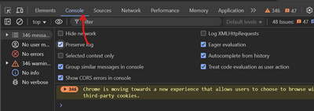
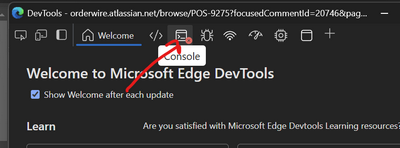
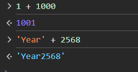
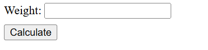
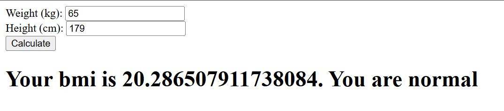

## HTML / CSS / JavaScript Roles
 - HTML, CSS: ใช้เพื่อสร้างกำหนดหน้าตาของ WebSite
 - JavaScript: ใช้เพื่อทำให้เว็บไซต์มีชีวิต สามารถที่จะโต้ตอบกับผู้ใช้ได้

## Tag &lt;script&gt;

เราสามารถเพิ่ม JavaScript ลงในเว็บไซต์ด้วยวิธีการง่าย ๆ ด้วยการแทรกแท็ก `<script></script>` ลงไปล่างสุดในส่วนของ `<body>`

```html
<!DOCTYPE html>
<html>
    <head>
        <!-- Some HTMLs -->
    </head>
    <body>
        <!-- Some HTMLs -->
        <script>
            // your javascript code right here!
        </script>
    </body>
</html>
```

## Basic JavaScript

JavaScript เป็นภาษาโปรแกรมมิ่งตัวหนึ่งที่ใช้ไวยากรณ์ เหมือน ๆ กับภาษาอื่น ๆ คือ
 - ทำงานจากบนลงล่าง
 - มีการใช้ block `{}`, `()` คล้ายกับภาษาซี เพื่อคุมขอบเขตบางอย่าง (ถ้าอ่านอันนี้แล้วงงข้ามเหอะ)

ในเบื้องต้น เราจะมาเรียนรู้การใช้งานการเขียนคำสั่ง (expression) ดังนี้ครับ

### 1. การเรียกใช้งานฟังค์ชั่น

ใน JavaScript เราสามารถเรียกฟังค์ชั่นพื้นฐาน ด้วยวิธีการแบบบ้าน ๆ เลยคือ

```js
// ชื่อฟังค์ชั่น(ค่าที่จะส่งคั่นแต่ละค่าด้วย comma (ไม่มีเว้นว่างได้))

// เช่น
func(1, 2) // เรียกพร้อมส่งค่า 1 และ 2
func() // เรียกโดยไม่ส่งค่าอะไรเข้าไป
```

เช่นถ้าเราเพิ่มคำสั่งนี้ลงไปใน `<script>` เป็น

```html
<script>
alert('Yey!!')
</script>
```

เมื่อลองเซฟ แล้ว reload หน้าใหม่ เราก็จะเห็นกล่องข้อความเด้งพร้อมกับคำว่า "Yey!!" สิ่งที่เราทำคือ
 - เราได้ทำการเรียกใช้ฟังค์ชั่น `alert`
 - เราส่งค่าเข้าไปด้านในฟังค์ชั่น 1 ตัวเป็นข้อความ "Yey!!"

ทีนี้บางคนอาจจะสงสัยว่า ทำไมต้องมี `'` คลุมหน้าหลังของข้อความด้วย ที่ต้องมีก็เพื่อให้ JavaScript รู้ว่าตรงบริเวณนี้เป็นข้อมูลแบบชนิด "ข้อความ" นั่นเอง 

ว่าแล้วก็ขออธิบายต่อเรื่อง "ชนิดของข้อมูล" (Data type) ใน JavaScript กัน ใน JavaScript จะมีชนิดข้อมูล อยู่แค่ 3 แบบ เท่านั้นคือ
 - ข้อความ (string) เช่น `'Yoyo!!'` ข้อสังเกตคือต้องล้อมรอบด้วย `, ', หรือ "
 - ตัวเลข (number) เช่น `12`, `10.459`
 - ค่าจริง/เท็จ (boolean) มีค่าเป็นได้แค่ `true` หรือ `false`

เพราะฉะนั้นถ้าเราลองแก้โค้ดข้างบนเป็น

```html
<script>
alert(1 + 2)
</script>
```

ก็จะเด้งกล่องข้อความ `3` ออกมาซึ่งเป็นผลจากการเอา 1 + 2 นั่นเอง

### 2. ตัวแปร และการให้ค่า (assignment)

คงเป็นการยากมากที่ในการเขียนโปรแกรมสักโปรแกรมเราจะไม่มีการเก็บข้อมูลไว้ในการคำนวน ยกตัวอย่าง เช่น สมมติเราจะเขียนโปรแกรมคำนวนพื้นที่รูปสี่เหลี่ยม เราก็ต้องเก็บค่าที่ผู้ใช้ป้อนสองค่า คือ `ความกว้าง`, `ความยาว`

ในการเขียนโปรแกรมเราจะเก็บค่าต่าง ๆ ที่ต้องการไว้ในสิ่งที่เรียกว่า "ตัวแปร" (variable)

ซึ่งใน JavaScript วิธีการสร้างตัวแปรง่ายมาก คือ การใช้คำสั่ง `let`

```js
let width = 2   // ให้ตัวแปร width มีค่าเท่ากับ 2
let height = 4  // ให้ตัวแปร height มีค่าเท่ากับ 4
let area = width * height // ให้ตัวแปร area มีค่าเท่ากับ width คูณ กับ height
alert(area)  // แสดงค่าของ area ในที่นี้ก็จะแสดงค่า เท่ากับ "8" ออกมา
```

ทีนี้เราลองมารับค่าจากผู้ใช้กันบ้าง สมมติเราจะเขียนโปรแกรมเพื่อคำนวนหาค่า BMI ซึ่งมีสูตรคำนวนคือ

```
BMI = น้ำหนัก(กิโลกรัม) / (ส่วนสูง(เมตร) * ส่วนสูง(เมตร))
```

ใน JavaScript มีคำสั่งที่ทำให้สามารถรับค่าที่ผู้ใช้ป้อนได้ง่าย ๆ คือคำสั่ง `prompt()`

รูปแบบการใช้งานคือ

```
prompt(ข้อความที่จะให้แสดงเป็นคำถาม)
```

จากข้างตันเรานำมาเขียนเป็น โปรแกรม BMI ได้ดังนี้

```js
let weight = prompt('Your weight (kg.)')
let height = prompt('Your height (cm.)')
weight = Number(weight)
height = Number(height) / 100
let bmi = weight / (height * height)
alert('Your bmi is ' + bmi)
```

 - บรรทัดที่ 1, 2 เป็นการรับค่าที่ป้อนเข้าไปเพื่อเก็บไว้ในตัวแปร `weight` กับ `height`
 - บรรทัดที่ 3, 4 มีการเรียกใช้คำสั่ง Number เพื่อแปลงชนิดข้อมูลให้กลายเป็น "ตัวเลข" เพราะว่าคำสั่ง prompt จะให้ค่ากลับเป็นชนิด "ข้อความ"
 - บรรทัดที่ 5 เป็นการคำนวนค่า bmi ตามสูตร
 - บรรทัดที่ 6 แสดงผลลัพธ์ สิ่งใหม่ที่โผล่มาคือ

```js
'Your bmi is ' + bmi
```

ใน JavaScript ถ้าเรานำข้อมูลชนิดข้อความไปทำการบวก (+) เข้ากับอะไรก็ตาม สิ่งที่ได้จะเป็น ข้อความตัวใหม่ ที่ต่อกัน

```js
'hello ' + 'ja'  // ได้ข้อความ 'hello ja'
'Year' + 2568    // ได้ข้อความ 'Year2568'

// ใช้วงเล็บช่วยด้วยก็ได้

'your age = ' + (100 + 25)   // ได้ข้อความ 'your age = 125'
```

### 3. คำสั่งเงื่อนไข (condition expression)

มาสู่คำสั่ง สุดท้ายของคลาสนี้แล้ว คือคำสั่งเงื่อนไข ใน JavaScript เราสามารถเขียนเงื่อนไขได้ใช้คำสั่ง `if` และ `else`

```js
if (เงื่อนไข) {
    // สิ่งที่จะให้ทำกรณีที่เงื่อนไขเป็น "จริง"
} else {
    // สิ่งที่จะให้ทำกรณีที่เงื่อนไขเป็น "เท็จ"
}
```

อธิบายนิดหน่อยว่า `เงื่อนไข` (condition) ใน JavaScript นั้นสามารถเขียนได้หลากหลายแบบมาก แต่สิ่งที่เป็นผลลัพท์จะมีเพียงสองค่า คือ `true` / `false` ซึ่งถ้าย้อนไปในชนิดข้อมูลในหัวข้อ ที่ 1 มันคือข้อมูลประเภท boolean นั่นเอง 

จากโปรแกรม BMI ถ้าเราจะกำหนดให้ว่า
 - ถ้าน้ำหนักน้อยกว่า 18.5 ให้ถือว่า น้ำหนักต่ำกว่าเกณฑ์ (underweight)
 - ถ้าน้ำหนักอยู่ในช่วง 18.5 แต่ไม่เกิน 25 ให้ถือว่า น้ำหนักปกติ (normal)
 - นอกเหนือจากนั้น ให้ถือว่า น้ำหนักเกิน (overweight)

เราสามารถแปลงออกมาเป็นชุดคำสั่ง JavaScript ได้แบบนี้

```js
let bmiText = ''
if (bmi <= 18.5) {  // เงื่อนไข (1)
    // ถ้า BMI น้อยกว่าหรือเท่ากับ 18.5 ให้ทำในนี้
    bmiText = 'underweight'
} else {
    // ถ้าเงื่อนไข (1) เป็นเท็จ จะเข้ามาทำในนี้ ซึ่งนั่นแปลว่า ณ บรรทัดนี้ bmi มีค่ามากเกิน 18.5
    if (bmi <= 25) { // เงื่อนไข (2)
        // ถ้า BMI มีค่าน้อยกว่า 25 (หรือถ้าพูดให้ถูกก็คือ ณ จุดนี้ bmi เกิน 18.5 แต่ก็ไม่เกิน 25)
        bmiText = 'normal'
    } else {
        // ถ้ายังไม่ใช่อีก (หรือถ้าพูดง่ายคือ มันเกิน 25)
        bmiText = 'overweight'
    }
}
```

ถ้ารวมชุดคำสั่งนี้ลงไปในโปรแกรม BMI ก่อนหน้าเราก็จะได้

```js
let weight = prompt('Your weight (kg.)')
let height = prompt('Your height (cm.)')
weight = Number(weight)
height = Number(height) / 100
let bmi = weight / (height * height)

let bmiText = ''
if (bmi <= 18.5) {
    bmiText = 'underweight'
} else {
    if (bmi <= 25) {
        bmiText = 'normal'
    } else {
        bmiText = 'overweight'
    }
}

alert('Your bmi is ' + bmi + '. You are ' + bmiText)
```

## Developer Console

ปัจจุบันมีเครื่องมือที่อำนวยความสะดวกในการทดสอบคำสั่ง JavaScript เรียกว่า Development Console

ใน Browser เช่น Chrome, Edge เราสามารถเปิดพวกนี้ขึ้นมาด้วยการกด F12 แล้วกดเข้าไปที่แท็บ "Console"

### ใน Google Chrome



### ใน MS Edge



ใน Console เราสามารถพิมพ์คำสั่งใด ๆ ลงไปเพื่อทดลองได้ เช่น



นอกจากนี้ใน JavaScript ถ้าหากเราใช้คำสั่ง `console.log(...)` เช่น `console.log(bmi)` ก็จะเป็นการแสดงค่าของตัวแปร `bmi` ลงมาอยู่ใน console ได้

## Interactive Website with JavaScript

ที่ผ่านมาข้างต้นเรายังไม่ได้เอา JavaScript ไปยุ่งเกี่ยวกับหน้าเว็บที่เป็น HTML เลย ต่อไปนี้จะเริ่มเข้าสู่เนื้อหาของการนำ JavaScript ไปยุ่งเกี่ยวกับหน้าเว็บซึ่งจะมี 3 เรื่องใหญ่ ๆ คือ

1. Element Selection: การหยิบจับวัตถุ (element) ในโลก HTML
2. HTML Element Interaction: การอ่านหรือแก้ไขค่า คุณลักษณะ ของวัตถุในโลก HTML
3. Event Handler: การเขียนคำสั่งที่ให้ไปทำงานหลังเกิดเหตุการณ์ขึ้นกับวัตถุในโลก HTML

ในที่นี้จะขอเริ่มจากตัวอย่างที่เรียบง่ายสุด ๆ โดยการสร้างหน้าเว็บโดยมีโค้ดในส่วนของ `<body>` ดังนี้

```html
<body>
    <div>
        Weight: <input type="number" id="weight" />
    </div>
    <div style="padding-top: 8px;">
        <button type="button" onclick="onCalculate">Calculate</button>
    </div>
</body>
```

ซึ่งถ้าเปิดด้วย Browser เราก็จะเห็นหน้าตาเว็บไซต์เป็นแบบนี้



และเมื่อเราลองเพิ่มโค้ดต่อไปนี้ใน JavaScript

```js
function onCalculate() {
    // หยิบวัตถุที่มี id เท่ากับ `weight`
    // จากนั้นอ่านค่าของ 'value' ที่อยู่ในวัตถุนั่น ซึ่งในที่นี้จะหมายถึง ค่าที่อยู่ในกล่องข้อความ
    let weight = document.getElementById('weight').value

    // นำค่ามาแสดงผล
    alert(weight)
}
```

เมื่อเซฟแล้วลองกดปุ่ม ก็จะแสดงค่าที่เรากรอกลงไป

ทีนี้เราลองมาเปลี่ยนโปรแกรม BMI ของเราให้รับค่าจาก textbox 2 อัน แล้วคำนวนหลังจากกดปุ่ม ซึ่งก็อาจจะได้โค้ดออกมาเป็นประมาณนี้

```html
<!DOCTYPE html>
<html lang="en">
<head>
    <meta charset="UTF-8">
    <meta name="viewport" content="width=device-width, initial-scale=1.0">
    <title>Simple Form</title>
</head>
<body>
    <div>
        Weight (kg): <input type="number" id="weight">
    </div>
    <div>
        Height (cm): <input type="number" id="height">
    </div>
    <button onclick="onCalculate()">Calculate</button>
    <h1 id="bmiResult"></h1>
    
    <script>
        function onCalculate() {
            let weight = Number(document.getElementById("weight").value);
            let height = Number(document.getElementById("height").value) / 100;
            let bmi = weight / (height * height)
            let bmiText = ''
            if (bmi <= 18.5) {
                bmiText = 'underweight'
            } else {
                if (bmi <= 25) {
                    bmiText = 'normal'
                } else {
                    bmiText = 'overweight'
                }
            }
            document.getElementById("bmiResult").innerHTML = 'Your bmi is ' + bmi + '. You are ' + bmiText
        }
    </script>
</body>
</html>
```

ผลลัพท์



## GPT Trick

ด้วยปัจจุบันเรามี ChatGPT หาก เราติดปัญหาตรงไหนเราสามารถถามไปตรง ๆ ได้เลยเช่น

```
In JavaScript, I want to create two textbox that receive `weight` in kg. and `height` in cm. to store in variables

how can I do?
```


```html
<!DOCTYPE html>
<html lang="en">
<head>
  <meta charset="UTF-8">
  <meta name="viewport" content="width=device-width, initial-scale=1.0">
  <title>Weight and Height Input</title>
</head>
<body>

  <label for="weight">Weight (kg):</label>
  <input type="text" id="weight" placeholder="Enter weight in kg"><br><br>

  <label for="height">Height (cm):</label>
  <input type="text" id="height" placeholder="Enter height in cm"><br><br>

  <button onclick="storeValues()">Submit</button>

  <script>
    function storeValues() {
      // Get values from the input fields
      const weight = document.getElementById('weight').value;
      const height = document.getElementById('height').value;

      // Optionally, parse the values to ensure they are numbers
      const weightInKg = parseFloat(weight);
      const heightInCm = parseFloat(height);

      // Store the values (or you can perform any operation here)
      console.log(`Weight: ${weightInKg} kg, Height: ${heightInCm} cm`);

      // You can also add some validation if needed
      if (isNaN(weightInKg) || isNaN(heightInCm)) {
        alert('Please enter valid numbers for both weight and height.');
      }
    }
  </script>

</body>
</html>
```